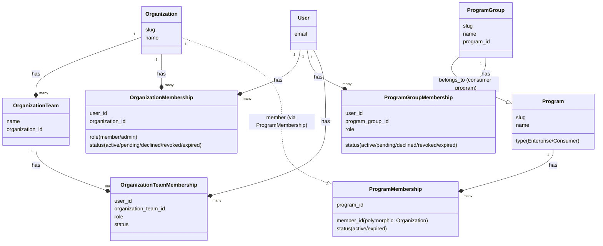
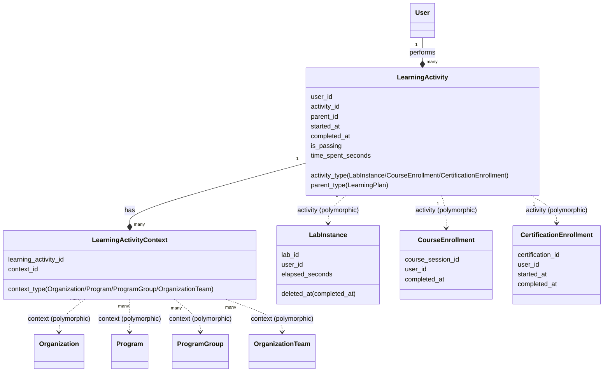

# Dashboard & Learning Activity Data Model

This document describes the data model and relationships between Organizations, Programs, Program Groups, Teams, Users, and their Learning Activities, primarily focusing on how data is structured for dashboard statistics.

## Core Entities & Contexts

The application tracks learning progress across different organizational scopes (contexts). These contexts are used to aggregate statistics on the dashboards.

*   **Organization**: Represents an enterprise customer.
*   **OrganizationTeam**: A subdivision within an Organization (e.g., "Team Dev", "Team Ops"). Belongs to an Organization.
*   **Program**: Represents a learning program.
    *   *Enterprise Program*: Linked to an Organization via `ProgramMembership`.
    *   *Consumer Program*: Used by `ProgramGroup`s.
*   **ProgramGroup**: A cohort of users within a consumer program. Belongs to a consumer `Program`.
*   **User**: The learner.

## Memberships & Scopes

Users are associated with contexts through membership models, which define their roles (e.g., member, admin) and status (e.g., active, pending, declined, revoked).

*   **OrganizationMembership**: Connects `User` to `Organization`.
*   **OrganizationTeamMembership**: Connects `User` to `OrganizationTeam`.
*   **ProgramGroupMembership**: Connects `User` to `ProgramGroup`.

## Learning Activity Tracking

The core of the statistics engine is `LearningActivity` and its association with contexts via `LearningActivityContext`.

*   **LearningActivity**: Records a single learning event for a `User` (e.g., starting/completing a lab, enrolling/completing a course, completing a certification).
    *   `activity`: Polymorphic association pointing to the actual execution record:
        *   `LabInstance` (for labs)
        *   `CourseEnrollment` (for courses, which wrap a `CourseSession`)
        *   `CertificationEnrollment` (for certifications)
    *   `parent`: Optional association (e.g., points to a `LearningPlan` if the activity was completed as part of that plan).
    *   Metrics: `started_at`, `completed_at`, `is_passing`, `time_spent_seconds`.

*   **LearningActivityContext**: A join model that links a `LearningActivity` to one or more contexts (`Organization`, `Program`, `ProgramGroup`, `OrganizationTeam`).
    *   **Crucial for Dashboards**: When an activity is recorded, `LearningActivityContext` entries are created for all contexts the user belongs to. Dashboards query `LearningActivity` through these context joins to aggregate statistics (e.g., "Labs completed by Team Dev in Org X").

## Auxiliary Models

*   **Catalog & CatalogItem**: Used to map content (Labs, Courses, Certifications) to Organizations via `OrganizationAvailableCatalog` and `CatalogOrganizationFilter`.
*   **BadgeAward & CredlyBadgeAward**: Track standard and external (Credly) badge completions.
*   **Searchjoy::Search**: Tracks searches performed by users within an Organization, optionally scoped to `OrganizationTeam`s. Used for "Search Trends" statistics.
